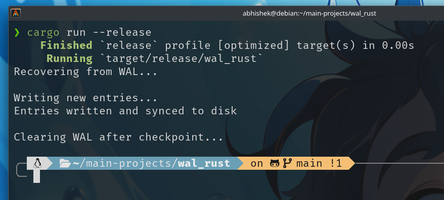
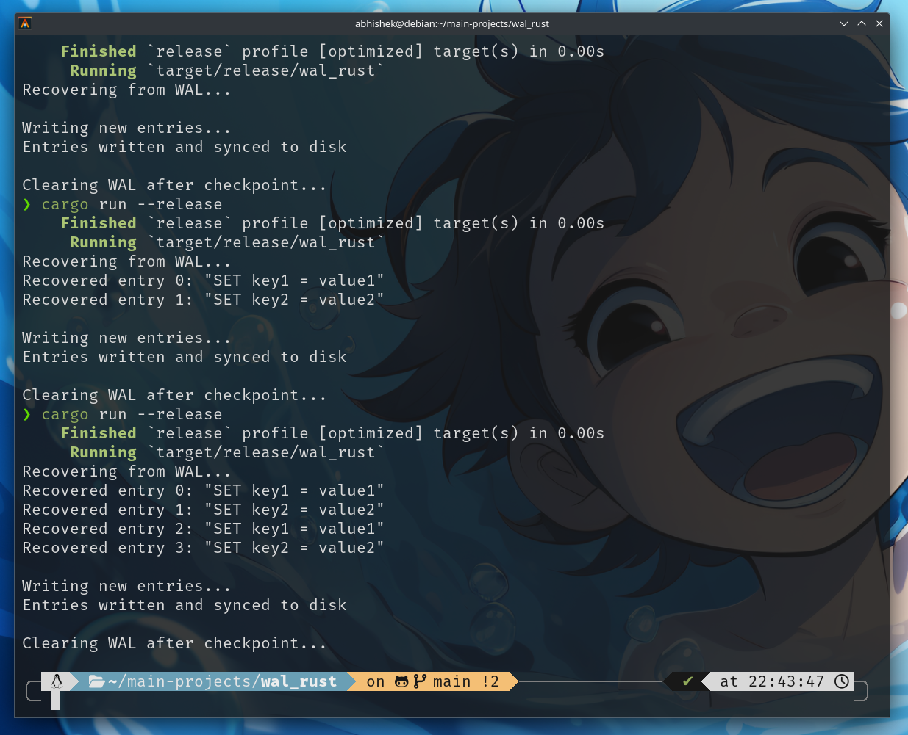

# Write-Ahead Log (WAL) in Rust

A minimal educational Write-Ahead Log implementation demonstrating the core durability mechanism used by databases like PostgreSQL, SQLite, and Redis. 

## What is a WAL?

A Write-Ahead Log ensures **durability** and **crash recovery** by logging every operation to disk *before* applying it to the main data structure. If the system crashes, the log can be replayed to restore the exact state before the crash.

This is how databases guarantee the "D" in ACID (Atomicity, Consistency, Isolation, **Durability**).

## Implementation Details

### Core Components

- **Append-only log file**: Operations are never overwritten, only appended
- **Synchronous writes**: `fsync()` forces data to physical disk, surviving power failures
- **Length-prefixed entries**: Each entry starts with a 4-byte length header for safe parsing
- **Recovery mechanism**: On startup, replay all logged operations
- **Checkpoint & truncation**: After applying entries to main storage, clear the log

### File Format

```
[4 bytes: length (big-endian)][N bytes: data]
[4 bytes: length (big-endian)][N bytes: data]
...
```

Example on disk:
```
00 00 00 11 "SET key1 = value1"
00 00 00 11 "SET key2 = value2"
```
## Here's the output

### This one is before commenting this line "wal.truncate()?;"


### This one is after commenting this line "wal.truncate()?;"


## Usage

### Basic Example

```rust
use std::io;

fn main() -> io::Result<()> {
    let mut wal = WAL::open("my_database.wal")?;
    
    // Recovery: replay uncommitted operations
    for entry in wal.read_all()? {
        apply_to_database(&entry);
    }
    
    // Normal operation: log before modifying state
    wal.append(b"INSERT INTO users VALUES (1, 'Alice')")?;
    update_main_database();
    
    // After successful checkpoint
    wal.truncate()?;
    
    Ok(())
}
```

### Testing Crash Recovery

1. **Comment out the truncate call** to simulate incomplete checkpoints:
   ```rust
   // wal.truncate()?;  // Simulates crash before checkpoint
   ```

2. **Build once:**
   ```bash
   cargo build --release
   ```

3. **Run multiple times** to see entries accumulate:
   ```bash
   cargo run --release  # Run 1: writes 2 entries
   cargo run --release  # Run 2: recovers 2, writes 2 more (total: 4)
   cargo run --release  # Run 3: recovers 4, writes 2 more (total: 6)
   ```

Each run demonstrates that data survives "crashes" (program restarts).

### Output Explanation

```
Recovering from WAL...
Recovered entry 0: SET key1 = value1
Recovered entry 1: SET key2 = value2
Writing new entries...
Entries written and synced to disk
```

- **Recovering from WAL**: Reads existing log on startup
- **Recovered entry N**: Shows previously logged operations being replayed
- **Entries written and synced**: New operations are durably stored (survived `fsync()`)

## Why This Matters

### Without WAL
```
1. Update in-memory data structure
2. Write to disk
3. [CRASH] ← Data loss!
```

### With WAL
```
1. Write operation to WAL
2. fsync() to disk
3. [CRASH] ← Safe! Operation logged
4. On restart: replay WAL → recover state
5. Apply to main storage
6. Truncate WAL
```

## Real-World Usage

This pattern is used in:

- **PostgreSQL**: WAL for replication and point-in-time recovery
- **SQLite**: WAL mode for concurrent readers
- **Redis**: AOF (Append-Only File) persistence
- **Kafka**: Commit log for message durability
- **LevelDB/RocksDB**: MemTable recovery after crashes

## Performance Considerations

### Current Implementation
- **Synchronous writes**: Every `append()` calls `fsync()` (slow but safe)
- **Simple format**: Length-prefixed entries, easy to parse
- **No compression**: Raw data stored as-is

### Production Optimizations
```rust
// Batch writes before fsync (group commit)
wal.append_batch(&[entry1, entry2, entry3])?;

// Async fsync in background thread
wal.append_async(entry).await?;

// Compression for space savings
wal.append_compressed(entry)?;

// Checksums for corruption detection
wal.append_with_checksum(entry)?;
```

## API Reference

### `WAL::open(path)`
Opens or creates a WAL file. If the file exists, positions the write pointer at the end for appending.

### `append(data: &[u8]) -> Result<u64>`
Appends an entry to the log and immediately syncs to disk. Returns the offset where the entry was written.

### `read_all() -> Result<Vec<Vec<u8>>>`
Reads all entries from the log, used during recovery. Automatically seeks back to the end for subsequent appends.

### `truncate() -> Result<()>`
Clears the log file. Only call this after successfully applying all entries to your main data structure.

## Safety Guarantees

1. **Crash-safe**: Data survives process crashes, kernel panics, and power failures  
2. **Durable**: `fsync()` ensures data reaches physical disk  
3.  **Ordered**: Entries are replayed in the exact order they were written  
4. **Complete**: Either an entry is fully written or not present (no partial entries)

## Limitations

- **No concurrency**: Single-threaded writes (use file locking for multi-process)
- **No compression**: Logs can grow large
- **No checksums**: Disk corruption not detected (add CRC32 for production)
- **Sequential reads only**: No random access to specific entries

## Building & Testing

```bash
# Development build
cargo build

# Optimized build
cargo build --release

# Run with recovery test
cargo run --release

# Run tests
cargo test

# Check code quality
cargo clippy
```

## Further Reading

- [PostgreSQL WAL Internals](https://www.postgresql.org/docs/current/wal-intro.html)
- [SQLite Write-Ahead Logging](https://www.sqlite.org/wal.html)
- [The Design and Implementation of a Log-Structured File System](https://people.eecs.berkeley.edu/~brewer/cs262/LFS.pdf)
- [ARIES: A Transaction Recovery Method](https://cs.stanford.edu/people/chrismre/cs345/rl/aries.pdf)

---
